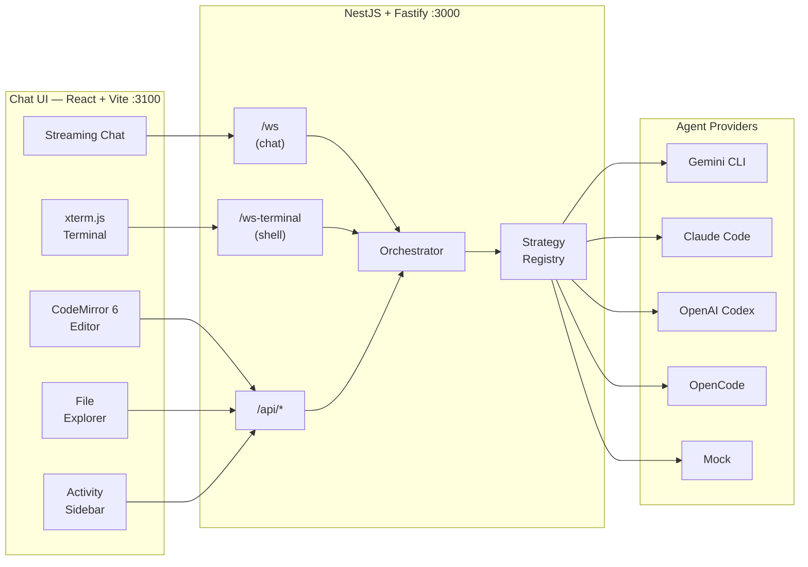

# Agents

This document is the single reference for everything agent-related in this repository: supported providers, configuration, authentication modes, conversation scoping, the WebSocket protocol, REST API surface, Docker images, and local development.

For full REST and WebSocket specs see [`docs/API.md`](docs/API.md).  
For the system prompt library see [`prompts/README.md`](prompts/README.md).

---

## Table of contents

- [Overview](#overview)
- [Providers](#providers)
- [Environment variables](#environment-variables)
- [Authentication modes](#authentication-modes)
- [Conversation context & persistence](#conversation-context--persistence)
- [Steering](#steering)
- [Prompts](#prompts)
- [Local MCP tools](#local-mcp-tools)
- [WebSocket protocol (`/ws`)](#websocket-protocol-ws)
- [WebSocket terminal (`/ws-terminal`)](#websocket-terminal-ws-terminal)
- [REST API](#rest-api)
- [Docker images](#docker-images)
- [Local development](#local-development)
- [Architecture](#architecture)
- [Adding a new provider](#adding-a-new-provider)

---

## Overview

The API (`apps/api`) acts as a thin orchestration layer between the chat frontend and an agent provider CLI. Each incoming WebSocket message is dispatched through the **OrchestratorService** → **StrategyRegistryService** → the active **AgentStrategy**, which spawns or communicates with a provider process and streams chunks back over the same WebSocket.

```
Chat UI  ──ws──▶  OrchestratorService  ──▶  GemmaRouterService (local Ollama)
                          │                         │ injects tool hint
                          ▼                         ▼
                  StrategyRegistryService ◀──────────
                          │
          ┌───────────────┤
          ▼       ▼       ▼
   GeminiStrategy  ClaudeStrategy  OpenCodeStrategy  …
```

Two WebSocket servers share a single HTTP upgrade dispatcher — `/ws` for chat and `/ws-terminal` for PTY shell sessions — avoiding competing upgrade listeners.

---

## Providers

| `AGENT_PROVIDER` value | Aliases | Transport | Docker tag |
|------------------------|---------|-----------|------------|
| `gemini`               | — | `@google/gemini-cli` CLI | `gemini` |
| `antigravity`          | — | Antigravity CLI (`agy`) | `antigravity` |
| `claude-code` (default) | — | `@anthropic-ai/claude-agent-sdk` (in-process SDK) | `claude-code` |
| `openai-codex`         | `openai` | `@openai/codex` CLI | `openai-codex` |
| `cursor`               | — | `cursor-agent` CLI | `cursor` |
| `opencode`             | `opencodex` | `opencode-ai` CLI | `opencode` |
| `mock`                 | — | _(built-in, no CLI)_ | — |

> **Note:** When `AGENT_PROVIDER` is not set, the code falls back to `claude-code`. Set it explicitly in production.

`mock` is useful for local UI development without any API key. It echoes configurable fake responses.

### Strategy files

All strategies live under `apps/api/src/app/strategies/`:

| File | Strategy |
|------|----------|
| `gemini.strategy.ts` | Gemini CLI — OAuth device flow or `GEMINI_API_KEY` |
| `antigravity.strategy.ts` | Antigravity CLI — Google OAuth code flow, `agy --prompt=<text>` headless runs |
| `claude-sdk.strategy.ts` | Claude Code — `@anthropic-ai/claude-agent-sdk` in-process SDK; OAuth or `ANTHROPIC_API_KEY` |
| `openai-codex.strategy.ts` | OpenAI Codex — OAuth or `OPENAI_API_KEY` |
| `cursor.strategy.ts` | Cursor Agent CLI — `CURSOR_API_KEY`, stream-json |
| `opencode.strategy.ts` | OpenCode — provider-selected API key env and config |
| `mock.strategy.ts` | No-op mock for local development |
| `abstract-cli.strategy.ts` | Shared base for the CLI-process strategies |
| `tool-use-to-event.ts` | Shared `toolUseToEvent` helper used by the Claude SDK strategy |
| `strategy-registry.service.ts` | Resolves the active strategy from `AGENT_PROVIDER` |
| `strategy.types.ts` | Shared TypeScript interfaces (`AgentStrategy`, `AuthConnection`, `StreamingCallbacks`, `TokenUsage`, etc.) |

### `AgentStrategy` interface

Every provider implements `AgentStrategy` from `strategy.types.ts`:

| Method | Required | Description |
|--------|----------|-------------|
| `executeAuth(connection)` | ✓ | Start the auth flow (OAuth / device code / paste) |
| `submitAuthCode(code)` | ✓ | Submit an OAuth code |
| `cancelAuth()` | ✓ | Abort an in-progress auth flow |
| `clearCredentials()` | ✓ | Delete cached tokens / session files |
| `executeLogout(connection)` | ✓ | Run provider logout command |
| `checkAuthStatus()` | ✓ | Async — return `true` if authenticated |
| `executePromptStreaming(prompt, model, onChunk, callbacks?, systemPrompt?, runtimeOptions?)` | ✓ | Stream a response; call `onChunk` per text chunk |
| `ensureSettings?()` | optional | Write provider config files before first run |
| `getWorkingDir?()` | optional | Working directory override for the CLI process |
| `prepareWorkingDir?()` | optional | Prepare or sync the provider working directory before a run |
| `getModelArgs?(model)` | optional | Translate a model name to CLI args |
| `listModels?()` | optional | Return available model names |
| `interruptAgent?()` | optional | Kill the running CLI process |
| `steerAgent?(message)` | optional | Natively steer or queue a message while the provider is busy |
| `hasNativeSessionSupport?()` | optional | Report whether the provider can resume a native conversation/session |

---

## Environment variables

Use [`fibe.example.yml`](fibe.example.yml) as the complete settings reference. `.env.example` is still useful for local process env and `FIBE_SETTINGS_JSON`, but settings such as `agentPassword`, `modelOptions`, `dataDir`, `systemPrompt`, `marqueeRoot`, and `postInitScript` are read from `fibe.yml` / `FIBE_SETTINGS_JSON` and then promoted to env for child processes.

### API (`apps/api`)

| Name | Default | Source | Description |
|------|---------|--------|-------------|
| `PORT` | `3000` | env | API listen port |
| `AGENT_PROVIDER` / `agentProvider` | `claude-code` | env or setting | Active provider: `gemini` \| `antigravity` \| `claude-code` \| `openai-codex` \| `cursor` \| `opencode` \| `mock` |
| `AGENT_AUTH_MODE` / `agentAuthMode` | `oauth` | env or setting | `oauth` browser/device flow, or `api-token` env-key mode |
| `agentPassword` | — | setting | Enables `/api` and `/ws` bearer-token auth; promoted to `AGENT_PASSWORD` for child processes |
| `modelOptions` | — | setting | Model names shown in the selector, as a comma-separated string or YAML/JSON list |
| `defaultModel` | first `modelOptions` entry | setting | Pre-selected model on startup |
| `claudeEffort` / `CLAUDE_EFFORT` | `max` | setting or env | Default Claude Code effort (`low`, `medium`, `high`, `xhigh`, `max`) |
| `dataDir` | `<cwd>/data` | setting | Base data directory for persistence |
| `FIBE_AGENT_ID` | — | env | Default conversation storage id set by Fibe |
| `CONVERSATION_ID` | — | env | Fallback default conversation storage id |
| `systemPrompt` | bundled prompt | setting | Inline system prompt content. If unset, `dist/assets/SYSTEM_PROMPT.md` is loaded. |
| `PLAYGROUNDS_DIR` | `./playground` | env | Root for the file explorer and shell sessions |
| `marqueeRoot` | `/opt/fibe` | setting | Root directory for Marquee local data; the Fibe CLI receives its `playgrounds` subdirectory |
| `postInitScript` | — | setting | Shell script run once on first boot; state at `GET /api/init-status` |
| `SESSION_DIR` / `sessionDir` | provider default | env or setting | Provider config/session dir (e.g. `~/.gemini`, `~/.codex`) |
| `AGENT_CREDENTIALS_JSON` / `agentCredentials` | — | env or setting | JSON map of credential file names to content, injected at startup |
| `encryptionKey` | — | setting | Optional key for AES-256-GCM data-at-rest encryption |
| `FIBE_API_KEY` | — | env | Fibe platform API key for sync |
| `fibeSyncEnabled` / `FIBE_SYNC_ENABLED` | `false` | setting or env | Enable Fibe platform sync |
| `CORS_ORIGINS` | `localhost:3100,localhost:4300` | env | Comma-separated allowed CORS origins |
| `FRAME_ANCESTORS` | `*` | env | CSP `frame-ancestors`; restrict in production |
| `LOG_LEVEL` | `info` | env | `error` \| `warn` \| `info` \| `debug` \| `verbose` |
| `MCP_CONFIG_JSON` / `mcpConfig` | — | env or setting | Stdio/HTTP MCP servers injected into provider config. Fibe deployments include the canonical local `fibe mcp serve --tools core --yolo` entry with `FIBE_API_KEY` and `FIBE_DOMAIN`; keep it unique per environment. |
| `DOCKER_MCP_CONFIG_JSON` | — | env | Additional Docker-specific MCP servers merged with `MCP_CONFIG_JSON` |
| `gemmaRouterEnabled`, `ollamaUrl`, `gemmaModel`, `gemmaConfidenceThreshold`, `gemmaTimeoutMs` | see `fibe.example.yml` | setting or env | Optional local Gemma intent router via Ollama |

### Provider API keys (`AGENT_AUTH_MODE=api-token`)

| Provider | Environment variable(s) |
|----------|------------------------|
| Gemini | `GEMINI_API_KEY` |
| Claude Code | `ANTHROPIC_API_KEY`, `CLAUDE_API_KEY`, or `CLAUDE_CODE_OAUTH_TOKEN` |
| OpenAI Codex | `OPENAI_API_KEY` |
| Cursor | `CURSOR_API_KEY` |
| OpenCode | `OPENROUTER_API_KEY`, `ANTHROPIC_API_KEY`, `OPENAI_API_KEY`, `GEMINI_API_KEY`, `GOOGLE_GENERATIVE_AI_API_KEY`, `GOOGLE_API_KEY`, or `DEEPSEEK_API_KEY` |

### Chat app (`apps/chat`, served via `GET /api/runtime-config`)

These variables are consumed at **runtime** (not build time) — the frontend fetches them from `GET /api/runtime-config` on load.

| Variable | Description |
|----------|-------------|
| `API_URL` | API base URL when running on a different host (default: same origin) |
| `LOCK_CHAT_MODEL` | Set to `true` to disable the model selector in the UI |
| `ASSISTANT_AVATAR_URL` | URL for the AI avatar image |
| `ASSISTANT_AVATAR_BASE64` | Base64-encoded SVG/PNG for the AI avatar (takes precedence over URL) |
| `USER_AVATAR_URL` | URL for the user avatar image |
| `USER_AVATAR_BASE64` | Base64-encoded SVG/PNG for the user avatar (takes precedence over URL) |
| `VITE_THEME_SOURCE` | `localStorage` (default) or `frame` — drive theme from parent via `postMessage`; `set_theme` uses canonical `light`/`dark` values, with legacy `winter`/`halloween` accepted only as normalized inputs |
| `VITE_HIDE_THEME_SWITCH` | `1` / `true` — hide the in-app theme toggle |
| `SIMPLICATE` | `1` / `true` — start with Simplicate switched on, using the compact chat header |

---

## Gemma Router (Local Intent Classification)

Fibe Agent includes an optional local LLM pre-processing layer powered by [Ollama](https://ollama.com) and Google's Gemma model. When enabled, it intercepts incoming user messages, runs a fast local classification to determine which MCP tools would help answer the request, and injects tool suggestions into the prompt before the main agent strategy sees it.

**Benefits:**
- **Improved tool accuracy:** Helps the main agent (Claude, Gemini, etc.) immediately pick the right MCP tool without having to infer it from context.
- **Privacy-preserving:** Runs 100% locally — no data leaves the machine.
- **Graceful degradation:** If Ollama is unavailable or too slow, the request proceeds normally without a hint.
- **Self-healing:** Uses lazy re-probe — if Ollama was down at startup, GemmaRouterService automatically retries connectivity before each request.

### Enabling the Router

1. Start Ollama and pull the model:
   ```sh
   docker run -d --name ollama -v ollama:/root/.ollama -p 11434:11434 ollama/ollama
   docker exec ollama ollama pull gemma3:4b
   ```
2. Set env vars in `.env`:
   ```env
   GEMMA_ROUTER_ENABLED=true
   OLLAMA_URL=http://localhost:11434
   GEMMA_MODEL=gemma3:4b
   GEMMA_CONFIDENCE_THRESHOLD=0.75
   GEMMA_TIMEOUT_MS=30000
   ```

### How it works

1. **Startup probe:** At startup, `GemmaRouterService` checks Ollama is reachable via `GET /api/tags`. On success, it fires a tiny warm-up inference (prompt: `"hi"`, 1 token) to pre-load the model into VRAM, eliminating cold-start latency on the first real user request.
2. **Lazy re-probe:** If Ollama was down at startup or crashes mid-session, the service automatically re-probes before each request and recovers without a server restart.
3. **Classification:** When a user sends a message, `GemmaRouterService` asks the local model to pick relevant tools from the `MCP_CONFIG_JSON` tool list based on user intent.
4. **Injection:** If confidence ≥ `GEMMA_CONFIDENCE_THRESHOLD`, a `[SYSTEM]Suggested MCP tools: ...[/SYSTEM]` block is prepended to the prompt sent to the main agent. **The persisted message history is never modified.**
5. **MCP config delivery:** For `claude-code`, the configured `.mcp.json` is passed via `--mcp-config <path>` directly to the Claude process, ensuring tools are always available regardless of project trust settings.

### Troubleshooting

| Symptom | Likely cause | Fix |
|---------|-------------|-----|
| Logs show `skipped: true` | Ollama not running or model not pulled | Run `docker exec ollama ollama pull gemma3:4b` |
| First request takes 30s | Model not warm (VRAM cold start) | Expected on first run; warm-up fires automatically at startup |
| Hint injected but agent ignores tool | MCP server not connected | Verify `MCP_CONFIG_JSON` is set and `--mcp-config` path is valid |

---

## Authentication modes

### `oauth` (default)

The strategy opens a browser URL or device-code flow. Steps:

1. Client sends `initiate_auth` over WebSocket.
2. Server emits `auth_url_generated` (OAuth) or `auth_device_code` (device flow) or `auth_manual_token` (Claude paste flow).
3. User completes auth in browser / pastes token.
4. Server emits `auth_success`.

### `api-token`

When `AGENT_AUTH_MODE=api-token`:
- `check_auth_status` uses the presence of the relevant env var as source of truth.
- `initiate_auth` immediately succeeds if the env var is present; otherwise reports `unauthenticated` without opening a browser.
- No interactive flow is needed — ideal for Docker / CI / API-key-only environments.

### Credential injection (Docker / Fibe)

`AGENT_CREDENTIALS_JSON` contains a JSON map of file names to their content. `credential-injector.ts` writes those files into `SESSION_DIR` before the strategy starts (files written with mode `0o600`), enabling passwordless startup:

```json
// Gemini
{ "agent_token.txt": "ya29.xxx" }

// Claude Code
{ "auth.json": "{\"api_key\":\"sk-ant-...\"}" }

// OpenAI Codex (OAuth token only)
{ "auth.json": "{\"access_token\":\"...\"}" }

// OpenCode
{ "auth.json": "{\"api_key\":\"sk-...\"}" }
```

`SESSION_DIR` must be set alongside `AGENT_CREDENTIALS_JSON`. The injector skips filenames with path separators (traversal protection).

---

## Conversation context & persistence

All agent state (messages, activities, uploads, init-status, and provider session markers) is scoped by a **conversation id**. Model and effort are global agent settings unless changed through the runtime stores.

| Env var | Description |
|---------|-------------|
| `FIBE_AGENT_ID` | Primary: set by Fibe when attaching a stored agent |
| `CONVERSATION_ID` | Fallback for non-Fibe multi-conversation setups |

When neither is set the default storage id is `default`, so the default conversation data lands under `dataDir/default/`.

The legacy/default conversation stores state under `ConfigService.getConversationDataDir()`, which resolves to `dataDir/<FIBE_AGENT_ID or CONVERSATION_ID or default>/`. User-created conversations are tracked separately under `dataDir/conversations/<id>/`:

```
dataDir/
├── <default-storage-id>/
│   ├── messages.json
│   ├── activity.json
│   ├── model.json
│   ├── effort.json
│   ├── uploads/
│   └── init-status/
└── conversations/
    ├── index.json
    └── <conversation-id>/
        ├── messages.json
        ├── activity.json
        ├── uploads/
        └── provider session marker files
```

Provider workspaces are shared from the default conversation data dir where supported, while provider session marker files are conversation-scoped so each Fibe conversation can resume its native provider thread.

---

## Steering

The agent framework supports **Native Interrupt Steering**. Instead of relying on a file system queue, steering occurs natively per CLI tool. When a user queues a message while the agent is processing, the orchestrator delegates to the agent strategy's `steerAgent()` method, which interrupts the running process via a signal. The strategy then incorporates the interrupted context and pending messages directly into the next prompt or natively via the CLI's resume flags.

---

## Prompts

The runtime system prompt comes from the Fibe setting `systemPrompt` in `fibe.yml` / `FIBE_SETTINGS_JSON`, or from the bundled `dist/assets/SYSTEM_PROMPT.md` fallback. The [`prompts/`](prompts/) directory is an authoring/reference library for prompt variants; it is not loaded by setting a prompt path env var.

Prompt content for Rails-managed Fibe runtimes is owned by Fibe/Rails and passed in through `systemPrompt`; git prompt files in this repository are not the runtime source of truth. Provider strategies intentionally run in full-allowed modes where applicable, so safety policy is runtime/provider configuration plus the injected prompt, not enforcement from these reference prompt files.

### Directory layout

```
prompts/
├── README.md                   ← full usage guide and naming conventions
├── base/
│   └── code-playground.md      ← canonical prompt for code-generation sessions
└── providers/
    ├── gemini.md               ← Gemini CLI-specific prompt
    ├── antigravity.md          ← Antigravity CLI-specific prompt
    ├── claude-code.md          ← Claude Code-specific prompt
    ├── openai-codex.md         ← OpenAI Codex-specific prompt
    ├── cursor.md               ← Cursor-specific prompt
    └── opencode.md             ← OpenCode-specific prompt
```

### How prompts are loaded

The `OrchestratorService` resolves the active system prompt in this priority order:

1. **`systemPrompt` Fibe setting** - inline prompt content from `fibe.yml` or `FIBE_SETTINGS_JSON`.
2. **Built-in fallback** - `dist/assets/SYSTEM_PROMPT.md` bundled into the Docker image.

### Wiring a prompt

```yaml
# fibe.yml
systemPrompt: |
  You are a TypeScript expert.
  Work only in src/.
```

```sh
FIBE_SETTINGS_JSON='{"systemPrompt":"You are a TypeScript expert. Work only in src/."}'
```

### Provider-specific prompts

Each file in `prompts/providers/` extends the base code-playground behaviour with notes specific to that CLI tool's flags, session semantics, and known quirks. Use them when you know which `AGENT_PROVIDER` will run, or as reference material when tuning a base prompt.

| File | Provider | Notable additions |
|------|----------|------------------|
| `providers/gemini.md` | `gemini` | `--yolo` mode, `--resume` sessions, output-length advice |
| `providers/antigravity.md` | `antigravity` | `agy --prompt=<text>` headless mode, `--conversation` sessions, OAuth code flow |
| `providers/claude-code.md` | `claude-code` | Native file-edit tools, SDK resume sessions, extended thinking |
| `providers/openai-codex.md` | `openai-codex` | Codex execution transport notes, full-file writes, o-series reasoning |
| `providers/cursor.md` | `cursor` | `cursor-agent --print --output-format stream-json --force`, API-key auth |
| `providers/opencode.md` | `opencode` | API auto-detection, MCP tool usage, monorepo commands |

See [`prompts/README.md`](prompts/README.md) for full authoring guidelines.

---

## Local MCP tools

Every agent CLI that supports MCP automatically receives a built-in **local tool server** (`fibe-local`) injected into its `--mcp-config` at startup. This enables the AI to interact with the operator and the chat UI without any manual configuration.

### Available tools

| Tool | Blocking? | Description |
|------|-----------|-------------|
| `ask_user` | ✅ Yes | Ask the operator an open-ended question. Returns `{ answer: string }`. A `QuestionCard` appears in the chat; the agent is blocked until the operator submits a reply. |
| `confirm_action` | ✅ Yes | Ask for a yes/no decision before a destructive action. Returns `{ confirmed: boolean }`. A `ConfirmCard` appears in the chat. |
| `show_image` | No | Render an image inline in the chat thread. Accepts `url` or `base64` + `mimeType`. Returns `{ ok: true }`. |
| `set_mode` | No | Change the agent mode (`exploring`, `casting`, `overseeing`, `build`). Returns `{ ok, mode }`. |
| `get_mode` | No | Read the current agent mode. Returns `{ mode: string }`. |
| `notify` | No | Send a toast notification (`info`, `success`, `warning`, `error`). Returns `{ ok: true }`. |
| `set_title` | No | Update the activity run title in the sidebar. Returns `{ ok: true }`. |

### Architecture

```
Agent CLI (MCP client)
    │ stdio JSON-RPC
    ▼
local-mcp.server.ts (child process)
    │ HTTP POST /api/local-tool-call (loopback)
    ▼
LocalMcpService (NestJS)
    │ outbound$ Subject
    ▼
OrchestratorService → WebSocket → Chat UI
    ▲
    │ answer_user_question / confirm_action_response WS actions
Chat UI (QuestionCard / ConfirmCard)
```

`ask_user` and `confirm_action` **block** the agent CLI until the operator responds in the chat UI. All other tools are fire-and-forget.

### Environment variable

| Variable | Default | Description |
|----------|---------|-------------|
| `ASK_USER_TIMEOUT_MS` | `300000` (5 min) | How long `LocalMcpService` waits for an operator reply before rejecting blocking tool calls with a timeout error. |

---

## WebSocket protocol (`/ws`)

**URL:** `ws://localhost:3000/ws` (or `wss://` in production)
**Auth:** `?token=<password>` when `agentPassword` is configured
**Conversation:** `conversation_id` or `c` query param binds the session to a conversation; default is `default`
**Session:** multi-session up to `websocketMaxConnections` / `WEBSOCKET_MAX_CONNECTIONS` (default `5`); at the cap, the oldest connected client is evicted with close code `4002`

**Close codes:**

| Code | Meaning |
|------|---------|
| `4001` | Unauthorized (wrong or missing token) |
| `4002` | Oldest session evicted because the connection cap was reached |
| `4004` | Unknown `conversation_id` |

### Client → Server

All messages are JSON objects with an `action` field.

| `action` | Payload | Description |
|----------|---------|-------------|
| `check_auth_status` | — | Request current auth status |
| `initiate_auth` | — | Start provider auth flow |
| `submit_auth_code` | `{ code }` | Submit OAuth code |
| `cancel_auth` | — | Cancel ongoing auth |
| `reauthenticate` | — | Clear credentials and re-authenticate |
| `logout` | — | Log out from provider |
| `send_chat_message` | `{ text, images?, audio?, audioFilename?, attachmentFilenames? }` | Send user message; `images` = base64 data URLs, `audio` = base64, `attachmentFilenames` from `POST /api/uploads`. Text may contain `@path` references to playground files. If agent is busy, message is queued automatically. |
| `queue_message` | `{ text }` | Explicitly queue a message while the agent is busy |
| `submit_story` | `{ story }` | Submit activity story array after stream ends |
| `get_model` | — | Request current model |
| `set_model` | `{ model }` | Set model name |
| `get_effort` | — | Request current Claude effort |
| `set_effort` | `{ effort }` | Set Claude effort (`low`, `medium`, `high`, `xhigh`, `max`) |
| `interrupt_agent` | — | Stop the current agent run |
| `set_agent_mode` | `{ mode }` | Set agent mode; `mode` is a canonical key (`exploring`, `casting`, `overseeing`, `build`) or its display string |
| `answer_user_question` | `{ questionId, answer }` | Reply to an `ask_user_prompt` event from the agent; `questionId` must match the one from the event |
| `confirm_action_response` | `{ questionId, confirmed }` | Reply to a `confirm_action_prompt` event; `confirmed` is a boolean |

### Server → Client

All messages are JSON objects with a `type` field.

| `type` | Extra fields | Description |
|--------|-------------|-------------|
| `auth_status` | `status`, `isProcessing` | `authenticated` \| `unauthenticated` |
| `conversation_id` | `conversationId` | Conversation id for this session, sent immediately after connect |
| `sessions_updated` | `count` | Current connected chat WebSocket count |
| `auth_url_generated` | `url` | OAuth URL to open |
| `auth_device_code` | `code` | Device code to display to user |
| `auth_manual_token` | — | Prompt user to paste a token (Claude) |
| `auth_success` | — | Auth completed |
| `logout_output` | `text` | CLI logout output chunk |
| `logout_success` | — | Logout completed |
| `error` | `message` | Error description |
| `message` | `id`, `role`, `body`, `created_at`, `imageUrls?`, `story?`, `model?` | Persisted message |
| `stream_start` | `model?` | Beginning of assistant response stream |
| `stream_chunk` | `text` | One chunk of the streaming response |
| `stream_end` | `usage?`, `model?` | End of stream; `usage: { inputTokens, outputTokens }` |
| `reasoning_start` | — | Start of reasoning/thinking stream |
| `reasoning_chunk` | `text` | Chunk of reasoning text |
| `reasoning_end` | — | End of reasoning stream |
| `thinking_step` | `id`, `title`, `status`, `details?`, `timestamp` | Discrete thinking step (`pending` \| `processing` \| `complete`) |
| `tool_call` | `name`, `path?`, `summary?`, `command?` | Tool invocation; `command` for terminal-style display |
| `file_created` | `name`, `path?`, `summary?` | File created by agent |
| `activity_snapshot` | `activity` | Full activity list sent on connect |
| `activity_appended` | `entry` | New activity added |
| `activity_updated` | `entry` | Existing activity updated |
| `playground_changed` | — | Playground directory changed |
| `model_updated` | `model` | Current model name changed |
| `effort_updated` | `effort` | Current Claude effort changed |
| `agent_mode_updated` | `mode` | Current agent mode display string (e.g. `Exploring...`) |
| `ask_user_prompt` | `questionId`, `question`, `placeholder?` | Agent is asking the operator a question; a `QuestionCard` appears in the chat UI. Block the agent until `answer_user_question` is sent. |
| `confirm_action_prompt` | `questionId`, `message`, `confirmLabel?`, `cancelLabel?` | Agent requires a yes/no decision before proceeding; a `ConfirmCard` appears. Block the agent until `confirm_action_response` is sent. |
| `show_image` | `url?`, `base64?`, `mimeType?`, `caption?` | Display an image inline in the chat thread (non-blocking). |
| `notify` | `message`, `level` | Show a transient toast notification (`info` \| `success` \| `warning` \| `error`); non-blocking. |

**Story / activity timeline:** the client assembles a chronological story from `stream_start`, `reasoning_*`, `thinking_step`, `tool_call`, and `file_created` events (in order) and submits it back with `submit_story` after `stream_end`.

---

## WebSocket terminal (`/ws-terminal`)

**URL:** `ws://localhost:3000/ws-terminal`  
**Auth:** same `?token=<password>` as `/ws`

Each connection spawns a dedicated `node-pty` shell session in `PLAYGROUNDS_DIR`. Supports multiple simultaneous sessions (each gets a UUID).

**Client → Server messages:**

| Message | Description |
|---------|-------------|
| Raw string | Written directly to the PTY stdin |
| `{ type: "resize", cols: N, rows: N }` | Resize the PTY window |

**Server → Client:** raw terminal output (not JSON), batched in 16ms frames for efficiency.

The session is destroyed when the WebSocket closes or the PTY process exits.

---

## REST API

**Base URL:** `http://localhost:3000/api`
**Auth:** `Authorization: Bearer <password>` or `?token=<password>` when `agentPassword` is configured.
**Rate limit:** 100 requests per minute per client.

| Method | Path | Auth | Description |
|--------|------|------|-------------|
| `GET` | `/api/health` | No | `{ status: 'ok' }` — readiness / liveness probe |
| `POST` | `/api/auth/login` | No | `{ password? }` → `{ success, token? }` |
| `GET` | `/api/messages` | Bearer | Full message history |
| `GET` | `/api/activities` | Bearer | Activity timeline list |
| `GET` | `/api/activities/:activityId` | Bearer | Single activity |
| `GET` | `/api/activities/:activityId/:storyId` | Bearer | Deep link to a story entry |
| `GET` | `/api/activities/by-entry/:entryId` | Bearer | Activity containing a story entry |
| `GET` | `/api/model-options` | Bearer | Available model names array |
| `POST` | `/api/model-options/refresh` | Bearer | Configured models plus provider-discovered models |
| `GET` | `/api/playgrounds` | Bearer | Playground file tree |
| `GET` | `/api/playgrounds/file?path=…` | Bearer | Read a playground file → `{ content }` |
| `PUT` | `/api/playgrounds/file` | Bearer | `{ path, content }` — save a playground file → `{ ok }` |
| `GET` | `/api/playgrounds/stats` | Bearer | Playground directory stats |
| `GET` | `/api/playrooms/browse?path=…` | Bearer | Flat local playground names from `fibe --output json local playgrounds info --view names`; non-empty `path` returns `[]` |
| `POST` | `/api/playrooms/link` | Bearer | `{ path }` — delegates linking to `fibe local playgrounds link <name> --link-dir <PLAYGROUNDS_DIR>` |
| `GET` | `/api/playrooms/current` | Bearer | Current `.current_playground` value → `{ current }` |
| `GET` | `/api/agent-files` | Bearer | Agent-generated file tree |
| `GET` | `/api/agent-files/file?path=…` | Bearer | Read an agent-generated file |
| `POST` | `/api/uploads` | Bearer | Upload file (multipart, ≤ 20 MB) → `{ filename }` |
| `GET` | `/api/uploads/:filename` | Bearer | Serve an uploaded file |
| `GET` | `/api/agent/status` | Bearer | Auth, processing, queue count, and last error for the default conversation |
| `POST` | `/api/agent/send-message` | Bearer | `{ text, images?, attachmentFilenames?, conversationId?, busyPolicy? }` → `202 { accepted, messageId, conversationId?, resolvedPolicy? }` |
| `POST` | `/api/agent/interrupt` | Bearer | Interrupt the active provider turn |
| `DELETE` | `/api/agent/queue/:turnId` | Bearer | Remove a queued turn |
| `PATCH` | `/api/agent/queue/:turnId` | Bearer | Update queued turn text/policy |
| `POST` | `/api/agent/queue/reorder` | Bearer | Reorder queued turns |
| `GET` | `/api/conversations` | Bearer | List visible conversations |
| `POST` | `/api/conversations` | Bearer | Create or upsert a conversation |
| `PATCH` | `/api/conversations/:id` | Bearer | Update conversation metadata |
| `PATCH` | `/api/conversations/:id/title` | Bearer | Rename a conversation |
| `DELETE` | `/api/conversations/:id` | Bearer | Delete a user-created conversation |
| `GET` | `/api/conversations/:id/messages` | Bearer | Messages for one conversation |
| `GET` | `/api/conversations/:id/activities` | Bearer | Activity log for one conversation |
| `GET` | `/api/conversations/:id/live` | Bearer | Non-durable live state for one conversation |
| `GET` | `/api/conversations/:id/provider-traffic` | Bearer | Raw provider traffic for one conversation |
| `POST` | `/api/conversations/:id/agent/send-message` | Bearer | Send a turn to a specific conversation |
| `POST` | `/api/conversations/:id/agent/interrupt` | Bearer | Interrupt a specific conversation |
| `DELETE` | `/api/conversations/:id/queue/:turnId` | Bearer | Remove a queued turn for one conversation |
| `PATCH` | `/api/conversations/:id/queue/:turnId` | Bearer | Update a queued turn for one conversation |
| `POST` | `/api/conversations/:id/queue/reorder` | Bearer | Reorder one conversation's queue |
| `GET` | `/api/init-status` | Bearer | Post-init script state |
| `GET` | `/api/data-privacy/export` | Bearer | Export conversation data as JSON |
| `DELETE` | `/api/data-privacy` | Bearer | Permanently delete conversation data |
| `GET` | `/api/runtime-config` | No | Runtime env vars exposed to the chat frontend (avatars, etc.) |
| `GET` | `/api/agent-mode` | Bearer | Current agent mode → `{ mode: string }` (display string, e.g. `"Exploring..."`) |
| `POST` | `/api/agent-mode` | Bearer | `{ mode }` — set mode by key or display string → `{ success, mode }`. Valid keys: `exploring`, `casting`, `overseeing`, `build`. Returns 400 for unknown values. |
| `POST` | `/api/local-tool-call` | Bearer | Internal loopback endpoint called by the local MCP stdio child process. Forwards tool calls (`ask_user`, `confirm_action`, etc.) to `LocalMcpService`. Not intended for external callers. |

**`POST /api/agent/send-message`** is designed for webhooks and integrations (e.g. Sentry). It returns `400` (empty text), `403` (need auth), `404` (unknown conversation), or `409` (agent busy / busy policy rejected).

**`PUT /api/playgrounds/file`** is used by the CodeMirror editor to persist file edits without leaving the chat UI.

---

## Docker images

The root Compose CI pipeline publishes multi-arch (`linux/amd64`, `linux/arm64`) images to GHCR when its `ci-build-<provider>` services run:

```
ghcr.io/<owner>/fibe-agent:gemini-latest
ghcr.io/<owner>/fibe-agent:antigravity-latest
ghcr.io/<owner>/fibe-agent:claude-code-latest
ghcr.io/<owner>/fibe-agent:openai-codex-latest
ghcr.io/<owner>/fibe-agent:cursor-latest
ghcr.io/<owner>/fibe-agent:opencode-latest

# Dev branch:
ghcr.io/<owner>/fibe-agent:<provider>-latest-dev

# Immutable SHA pin:
ghcr.io/<owner>/fibe-agent:<provider>-<git-sha>
```

The provider is baked in at build time via `--build-arg AGENT_PROVIDER=<value>`. The image installs the corresponding CLI tool plus system dependencies: git, docker, ripgrep, fd, Python, Deno, uv, ffmpeg, ImageMagick, Playwright/Chromium (for MCP), sqlite3, pandoc, and more. The built `dist/` (API) and `chat/` (frontend) bundles are copied in last to maximise layer cache reuse.

### Run with Docker

```sh
docker run -p 3000:3000 \
  -e AGENT_PROVIDER=gemini \
  -e GEMINI_API_KEY=AIza... \
  -e AGENT_AUTH_MODE=api-token \
  ghcr.io/<owner>/fibe-agent:gemini-latest
```

### Session directories per provider

| Provider | `SESSION_DIR` |
|----------|--------------|
| `gemini` | `/home/node/.gemini` |
| `antigravity` | `/home/node/.gemini` |
| `claude-code` | `/home/node/.claude` |
| `openai-codex` | `/home/node/.codex` |
| `cursor` | `/home/node/.cursor` |
| `opencode` | `/home/node/.local/share/opencode` |

---

## Local development

### Prerequisites

- [Bun](https://bun.sh) — version pinned in `packageManager` in `package.json` (`bun@1.3.11`)
- Node 24 (see `.nvmrc`) for native addon compatibility (`node-pty`)

### Setup

```sh
bun install
cp .env.example .env  # fill in AGENT_PROVIDER and relevant keys
bun run dev           # local Nx dev: API :3000 + Chat :3100 in parallel
```

### Run services individually

```sh
bunx nx serve api     # API only  → http://localhost:3000
bunx nx serve chat    # Chat only → http://localhost:3100
```

### Without an API key (mock provider)

```sh
AGENT_PROVIDER=mock bunx nx serve api
```

### Scripts

| Script | Command | Description |
|--------|---------|-------------|
| `dev` | `bun run dev` | Local API + Chat through Nx |
| `dev:docker` | `bun run dev:docker` | Docker/Mutagen API + Chat with serialized API restarts |
| `build` | `bun run build` | Build all apps |
| `lint` | `bun run lint` | Lint all projects |
| `test` | `bun run test` | Run unit test suite |
| `typecheck` | `bun run typecheck` | TypeScript type-check |
| `e2e` | `bun run e2e` | Playwright e2e suites |
| `ci` | `bun run ci` | lint + build + typecheck + test |
| `ci:notest` | `bun run ci:notest` | lint + build + typecheck only |

### Testing

Unit tests are co-located with source files (`*.spec.ts` / `*.test.ts`). Coverage is enforced at 100%.

```sh
bun run test                    # all projects
bunx nx test api                # API only
bunx nx test chat               # Chat only
```

Playwright e2e:

```sh
bun run e2e                     # all e2e suites
bunx nx e2e e2e-api             # API e2e only
bunx nx e2e e2e-chat            # Chat e2e only
```

---

## Architecture



### API module map

| Module | Location | Responsibility |
|--------|----------|----------------|
| `orchestrator` | `app/orchestrator/` | Drives agent runs, streams chunks, manages session state |
| `strategies` | `app/strategies/` | Provider adapters + strategy registry |
| `gemma-router` | `app/gemma-router/` | Local Ollama intent classifier — suggests MCP tools before the main agent runs |
| `agent` | `app/agent/` | `POST /api/agent/send-message` — async webhook endpoint |
| `agent-files` | `app/agent-files/` | File watcher + REST for agent-generated files |
| `auth` | `app/auth/` | Bearer token guard and login endpoint |
| `messages` / `message-store` | `app/messages/`, `app/message-store/` | Message history REST + in-memory store |
| `activity` / `activity-store` | `app/activity/`, `app/activity-store/` | Activity timeline REST + in-memory store |
| `model-options` / `model-store` / `effort-store` | `app/model-options/`, `app/model-store/`, `app/effort-store/` | Model list + model/effort selection state |
| `playgrounds` | `app/playgrounds/` | File tree watcher, REST, playroom browser + linker |
| `uploads` | `app/uploads/` | Multipart upload validation + file serving |
| `terminal` | `app/terminal/` | `node-pty` shell sessions over `/ws-terminal` |
| `fibe-sync` | `app/fibe-sync/` | Syncs conversation state to the Fibe platform |
| `github-token-refresh` | `app/github-token-refresh/` | Refreshes GitHub OAuth tokens for Codex |
| `init-status` | `app/init-status/` | Tracks `POST_INIT_SCRIPT` execution state |
| `persistence` | `app/persistence/` | Base filesystem persistence helpers |
| `config` | `app/config/` | Central env-config service |
| `audit` | `app/audit/` | Request audit logging interceptor |
| `crypto` | `app/crypto/` | AES-256-GCM data-at-rest encryption |
| `data-privacy` | `app/data-privacy/` | GDPR export and delete endpoints |
| `runtime-config` | `app/runtime-config/` | Exposes runtime env vars (avatars, etc.) to the frontend |

---

## Adding a new provider

1. **Create a strategy** in `apps/api/src/app/strategies/<name>.strategy.ts` implementing the `AgentStrategy` interface from `strategy.types.ts`. Extend `AbstractCliStrategy` if it wraps a CLI binary.
2. **Register it** in `strategy-registry.service.ts` — add a new `case` for your `AGENT_PROVIDER` value.
3. **Update the Dockerfile** — add an `elif` branch to install your CLI in the `cli` and final stages; add a session directory `mkdir` in the final stage.
4. **Document provider keys** in `.env.example` and add them to the table in this file.
5. **Write tests** — add `<name>.strategy.test.ts` with the same coverage pattern as the existing strategies.
6. **Add a provider build service** to the root Compose CI file [`ci.yml`](ci.yml), following the existing `ci-build-<provider>` service pattern. The GitHub Actions workflow is currently disabled as `.github/workflows/ci.yml.disabled`.
