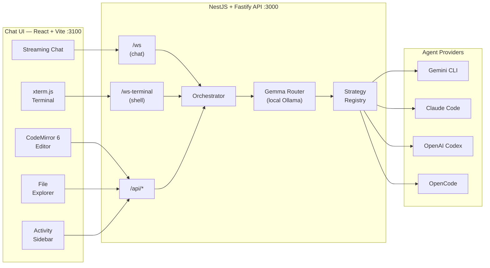

<p align="center">
  
</p>

<h1 align="center">Fibe Agent</h1>

<p align="center">
  <strong>A full-stack AI coding agent — streaming chat, inline code editor, interactive terminal, and multi-provider orchestration in a production Nx monorepo.</strong>
</p>

<p align="center">
  
  
  <a href="https://bun.sh"></a>
  <a href="https://nx.dev"></a>
  
</p>

<p align="center">
  
  
  
  
  
  
</p>

---

**Fibe Agent** pairs a **NestJS + Fastify** API with a **React + Vite** chat client. The API orchestrates coding agents (Gemini, Antigravity, Claude Code, OpenAI Codex, Cursor, OpenCode, or a mock provider) over a streaming WebSocket. The UI delivers a rich coding environment: streaming markdown chat, a **CodeMirror 6 inline editor**, an **xterm.js interactive terminal**, an activity/thinking sidebar, a file explorer with unsaved-change tracking, voice input, drag-&-drop file attachments, `@`-mention file references, and OAuth flows — all with light/dark theming and iframe-embedding support.

## Features at a glance

| Area | Details |
|------|---------|
| **Multi-provider agents** | `gemini`, `antigravity`, `claude-code`, `openai-codex`, `cursor`, `opencode`, `mock` — select via `AGENT_PROVIDER`. OAuth and API-token auth modes. |
| **Streaming chat** | WebSocket at `/ws` with per-chunk streaming, reasoning/thinking steps, tool-call and file-created events, token usage, and agent interrupt. |
| **Inline code editor** | CodeMirror 6 with syntax highlighting for 15+ languages (JS/TS, Python, Go, Rust, Java, C++, CSS, HTML, Markdown, SQL, YAML, …), unsaved-change indicators, keyboard shortcuts, and REST-backed file persistence. |
| **Interactive terminal** | xterm.js terminal backed by `node-pty`, connected via WebSocket at `/ws-terminal`, spawning shell sessions in the playground directory. |
| **Activity sidebar** | Chronological timeline of agent thinking steps, tool calls, file operations, and reasoning with color-coded status (idle → thinking → complete). |
| **File explorer** | Real-time file tree of the playground via `PlaygroundWatcherService`; open, edit, view, and save files without leaving the chat. |
| **Voice input** | Browser `MediaRecorder` voice recorder that uploads audio and sends it as a message attachment. |
| **Gemma MCP Router** | Optional local LLM pre-pass using Ollama (`gemma3:4b`) to classify intent and suggest MCP tools with zero latency impact. |
| **File attachments** | Drag-&-drop or click-to-upload images, audio, PDF, Excel, Word, CSV, JSON, text — up to 20 MB per file. |
| **`@`-mention files** | Type `@` in the chat input to reference playground files; the API injects their contents into the agent prompt. |
| **Conversation persistence** | Messages, activities, model/effort choice, uploads, and provider session state scoped by conversation id (`FIBE_AGENT_ID` / `CONVERSATION_ID`). |
| **Fibe integration** | `FibeSyncService`, `postMessage` auto-auth, and iframe embed support with parent-controlled theming. |
| **Security** | Helmet (CSP, frame-ancestors), rate limiting (100 req/min), shared-password bearer token auth, multipart validation. |
| **Structured logging** | One JSON object per line to stdout; request IDs, HTTP and WebSocket context, configurable via `LOG_LEVEL`. |
| **100% unit coverage** | Every module has co-located spec files; Playwright e2e for API and Chat. |
| **Docker** | Multi-arch (`linux/amd64`, `linux/arm64`) images published to GHCR per provider on every push to `main` / `dev`. |

## Architecture



## Quick start

**Prerequisite:** [Bun](https://bun.sh) (version pinned in `packageManager` in `package.json`).

```sh
bun install
bun run dev
```

| URL | Description |
|-----|-------------|
| [http://localhost:3000](http://localhost:3000) | API — health at `/api/health` |
| [http://localhost:3100](http://localhost:3100) | Chat UI — Vite proxies `/api` and `/ws` to the API |

**No provider CLI?** Use the mock agent:

```sh
AGENT_PROVIDER=mock bunx nx serve api
```

**API on a different host?**

```sh
API_URL=http://localhost:3000 bunx nx serve chat
```

**Password-protected?** Configure `agentPassword` in `fibe.yml` or `FIBE_SETTINGS_JSON`, then sign in from the chat UI before sending messages. A bare `AGENT_PASSWORD` env var alone does not enable API/WebSocket auth.

When the container is launched by Fibe, it receives a mandatory built-in Fibe MCP definition through `MCP_CONFIG_JSON`. That canonical entry is intentionally local stdio (`fibe mcp serve --yolo`) and is parameterized with `FIBE_API_KEY` and `FIBE_DOMAIN`, so the shipped `fibe` binary inside the container and the MCP surface stay aligned without needing a separate daemon. Additional remote MCP servers can be layered on top per provider, but Fibe should be exposed only once per environment to avoid duplicate tool surfaces.

### Run services separately

| App | Command | Port |
|-----|---------|------|
| API | `bunx nx serve api` | 3000 |
| Chat | `bunx nx serve chat` | 3100 |

## Project layout

```
fibe-agent/
├── apps/
│   ├── api/          # NestJS + Fastify — WebSocket /ws & /ws-terminal, REST /api/*
│   ├── chat/         # React + Vite — chat, editor, terminal, sidebar, explorer
│   ├── e2e-api/      # Playwright e2e for the API
│   └── e2e-chat/     # Playwright e2e for the Chat UI
├── shared/           # Shared TS types, WS constants, API path helpers
├── docs/
│   └── API.md        # REST, WebSocket, and logging contract
├── AGENTS.md         # Agent providers, config, protocol, and architecture reference
├── playground/       # Agent working directory (file explorer root)
└── data/             # Persisted messages, activities, uploads (per conversation)
```

### API modules

| Module | Responsibility |
|--------|---------------|
| `orchestrator` | Drives agent runs, streams chunks, manages session state |
| `strategies` | Provider adapters: `gemini`, `antigravity`, `claude-code`, `openai-codex`, `cursor`, `opencode`, `mock` |
| `agent` | `POST /api/agent/send-message` — async webhook endpoint |
| `agent-files` | File watcher + REST for agent-generated files |
| `auth` | Bearer token guard, login endpoint |
| `messages` | Message store + REST |
| `activity` / `activity-store` | Activity timeline store + REST |
| `model-options` / `model-store` | Model selection state + REST |
| `playgrounds` | File tree watcher + REST (`/api/playgrounds`) |
| `uploads` | Multipart upload + file serving |
| `terminal` | `node-pty` shell sessions over `/ws-terminal` |
| `steering` | Runtime steering/override hints for the orchestrator |
| `fibe-sync` | Syncs conversation state back to the Fibe platform |
| `github-token-refresh` | Refreshes GitHub OAuth tokens for Codex |
| `init-status` | Tracks `POST_INIT_SCRIPT` execution state |
| `persistence` | Base persistence helpers |
| `config` | Central env-config service |

## Environment

Use [`fibe.example.yml`](fibe.example.yml) as the complete settings reference. Local `.env` files are still useful for true process env inputs and for `FIBE_SETTINGS_JSON`, but settings such as `agentPassword`, `modelOptions`, `dataDir`, `systemPrompt`, `marqueeRoot`, and `postInitScript` are read from `fibe.yml` / `FIBE_SETTINGS_JSON` and then promoted to env for child processes.

### API

| Name | Default | Source | Description |
|------|---------|--------|-------------|
| `PORT` | `3000` | env | API listen port |
| `AGENT_PROVIDER` / `agentProvider` | `claude-code` | env or setting | Active agent: `gemini` \| `antigravity` \| `claude-code` \| `openai-codex` \| `cursor` \| `opencode` \| `mock` |
| `AGENT_AUTH_MODE` / `agentAuthMode` | `oauth` | env or setting | `oauth` browser/device flow, or `api-token` env-key mode |
| `agentPassword` | — | setting | Enables `/api` and `/ws` bearer-token auth; promoted to `AGENT_PASSWORD` for child processes |
| `modelOptions` | — | setting | Model names shown in the selector, as a comma-separated string or YAML/JSON list |
| `defaultModel` | first `modelOptions` entry | setting | Pre-selected model |
| `claudeEffort` / `CLAUDE_EFFORT` | `max` | setting or env | Default Claude Code effort (`low`, `medium`, `high`, `xhigh`, `max`) |
| `dataDir` | `<cwd>/data` | setting | Base persistence directory |
| `FIBE_AGENT_ID` | — | env | Default conversation storage id set by Fibe |
| `CONVERSATION_ID` | — | env | Fallback default conversation storage id |
| `systemPrompt` | bundled prompt | setting | Inline prompt content. If unset, `dist/assets/SYSTEM_PROMPT.md` is loaded. |
| `PLAYGROUNDS_DIR` | `./playground` | env | Root for the file explorer and shell sessions |
| `postInitScript` | — | setting | Shell script run once on first boot; state exposed at `/api/init-status` |
| `SESSION_DIR` / `sessionDir` | provider default | env or setting | Provider config/session dir (e.g. `~/.gemini`, `~/.codex`) for credential injection |
| `AGENT_CREDENTIALS_JSON` / `agentCredentials` | — | env or setting | Credential files injected at startup |
| `FIBE_API_KEY` | — | env | Fibe platform API key for sync |
| `fibeSyncEnabled` / `FIBE_SYNC_ENABLED` | `false` | setting or env | Enable Fibe sync |
| `CORS_ORIGINS` | `localhost:3100,localhost:4300` | env | Comma-separated allowed CORS origins |
| `FRAME_ANCESTORS` | `*` | env | CSP `frame-ancestors` (restrict in production) |
| `LOG_LEVEL` | `info` | env | `error` \| `warn` \| `info` \| `debug` \| `verbose` |
| `gemmaRouterEnabled`, `ollamaUrl`, `gemmaModel`, `gemmaConfidenceThreshold`, `gemmaTimeoutMs` | see `fibe.example.yml` | setting or env | Optional local LLM MCP routing via Ollama |

**Provider API keys** (used when `AGENT_AUTH_MODE=api-token`):

| Provider | Key variable(s) |
|----------|----------------|
| Gemini | `GEMINI_API_KEY` |
| Claude Code | `ANTHROPIC_API_KEY`, `CLAUDE_API_KEY`, or `CLAUDE_CODE_OAUTH_TOKEN` |
| OpenAI Codex | `OPENAI_API_KEY` |
| OpenCode | `ANTHROPIC_API_KEY`, `OPENAI_API_KEY`, `GEMINI_API_KEY`, `GOOGLE_GENERATIVE_AI_API_KEY`, `GOOGLE_API_KEY`, `DEEPSEEK_API_KEY`, or `OPENROUTER_API_KEY` |

### Chat (Vite, optional)

| Variable | Description |
|----------|-------------|
| `API_URL` | API base URL when running on a different host (default: same origin) |
| `LOCK_CHAT_MODEL` | Set to `true` to disable the model selector |
| `ASSISTANT_AVATAR_URL` | Custom avatar URL for the AI side of chat |
| `USER_AVATAR_URL` | Custom avatar URL for the user side of chat |
| `VITE_THEME_SOURCE` | `localStorage` (default) or `frame` — drive theme from parent via `postMessage` |
| `VITE_HIDE_THEME_SWITCH` | `1` / `true` — hide the in-app theme toggle |

## API summary

Full spec: [docs/API.md](docs/API.md). Agent configuration, providers, and WebSocket protocol: [AGENTS.md](AGENTS.md).

### REST

| Method | Path | Auth | Description |
|--------|------|------|-------------|
| `GET` | `/api/health` | No | Health / readiness probe |
| `POST` | `/api/auth/login` | No | Password login → `{ success, token? }`; token is present only when `agentPassword` is configured |
| `GET` | `/api/messages` | Bearer | Conversation message history |
| `GET` | `/api/activities` | Bearer | Activity timeline list |
| `GET` | `/api/activities/:id` | Bearer | Single activity |
| `GET` | `/api/model-options` | Bearer | Available model names |
| `POST` | `/api/model-options/refresh` | Bearer | Configured models plus provider-discovered models |
| `GET` | `/api/playgrounds` | Bearer | Playground file tree |
| `GET` | `/api/playgrounds/file?path=…` | Bearer | Read a playground file |
| `GET` | `/api/playrooms/browse` | Bearer | Flat Fibe CLI local playground list, limited to selector-visible playgrounds with source mounts |
| `POST` | `/api/playrooms/link` | Bearer | Link a named local playground through the Fibe CLI |
| `GET` | `/api/playrooms/current` | Bearer | Current `.current_playground` selection |
| `POST` | `/api/uploads` | Bearer | Upload file (≤ 20 MB) |
| `GET` | `/api/uploads/:filename` | Bearer | Serve uploaded file |
| `POST` | `/api/agent/send-message` | Bearer | Async message (webhooks/integrations) → `202` |
| `GET` | `/api/init-status` | Bearer | Post-init script status |
| `GET` | `/api/data-privacy/export` | Bearer | Export active conversation data as JSON |
| `DELETE` | `/api/data-privacy` | Bearer | Permanently delete conversation data |

### WebSocket `/ws`

Connect with `?token=<password>` when `agentPassword` is configured. Pass `conversation_id` (or `c`) to bind a session to a conversation. Up to `websocketMaxConnections` / `WEBSOCKET_MAX_CONNECTIONS` chat clients may be connected at once (default `5`); when the cap is reached, the oldest client is closed with code `4002`.

**Key client→server actions:** `send_chat_message`, `interrupt_agent`, `set_model`, `set_effort`, `initiate_auth`, `submit_auth_code`, `cancel_auth`, `reauthenticate`, `logout`.

**Key server→client events:** `stream_start`, `stream_chunk`, `stream_end`, `reasoning_start/chunk/end`, `thinking_step`, `tool_call`, `file_created`, `auth_status`, `model_updated`, `effort_updated`.

### WebSocket `/ws-terminal`

Bidirectional shell I/O between xterm.js and a `node-pty` shell spawned in `PLAYGROUNDS_DIR`.

## Lockfiles

The repo keeps **`bun.lock`** (Bun, CI, Docker) and **`package-lock.json`** (npm compatibility). Never delete `bun.lock` before running `bun install` — workspace installs can fail. CI always uses `bun install --frozen-lockfile`.

## Scripts

| Script | Command | Description |
|--------|---------|-------------|
| `dev` | `bun run dev` | Local API + Chat through Nx |
| `dev:docker` | `bun run dev:docker` | Docker/Mutagen API + Chat with serialized API restarts |
| `build` | `bun run build` | Build all apps |
| `lint` | `bun run lint` | Lint all projects |
| `test` | `bun run test` | Unit tests (100% coverage) |
| `typecheck` | `bun run typecheck` | TypeScript type-check |
| `e2e` | `bun run e2e` | Playwright e2e suites |
| `ci` | `bun run ci` | Lint + build + typecheck + test |
| `ci:notest` | `bun run ci:notest` | Lint + build + typecheck only |

## Container images

The root Compose CI pipeline builds and pushes multi-arch (`linux/amd64`, `linux/arm64`) provider images when its `ci-build-<provider>` services run:

```
ghcr.io/<owner>/fibe-agent:<provider>-latest
ghcr.io/<owner>/fibe-agent:<provider>-<git-sha>

# latest-dev for the dev branch:
ghcr.io/<owner>/fibe-agent:<provider>-latest-dev
```

Providers: `gemini`, `antigravity`, `claude-code`, `openai-codex`, `cursor`, `opencode`. Pass `AGENT_PROVIDER` as a build arg; see [Dockerfile](Dockerfile) and the root Compose CI file [ci.yml](ci.yml). The GitHub Actions workflow is currently disabled as `.github/workflows/ci.yml.disabled`.

## Embedding (iframe)

The chat can run inside a `<iframe>` in another app (e.g. Fibe):

- **Auto-auth:** parent posts `{ action: 'auto_auth', password: '…' }` → chat logs in automatically.
- **Theme control:** parent posts `{ action: 'set_theme', theme: 'light'|'dark' }` (requires `VITE_THEME_SOURCE=frame`). Legacy `winter` and `halloween` inputs are accepted and normalized to `light` and `dark`.

## License

MIT — see `package.json`.
